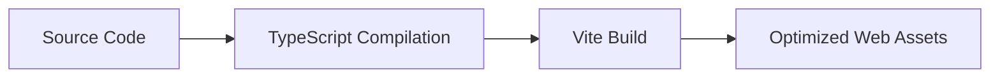
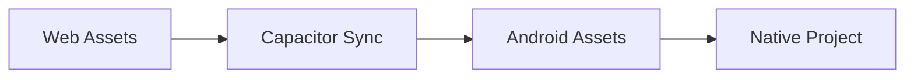
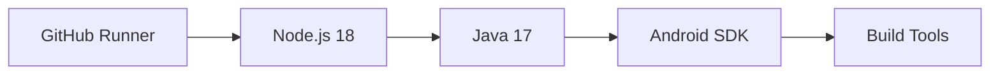
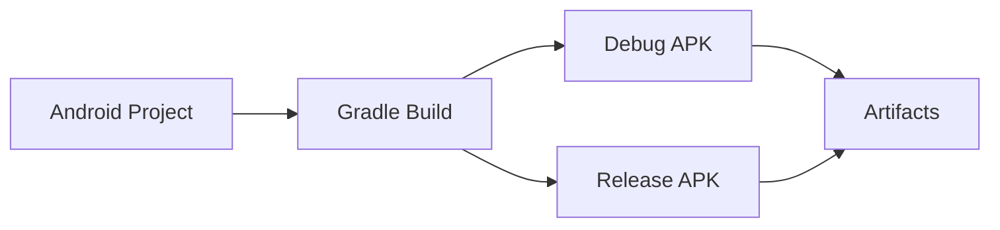
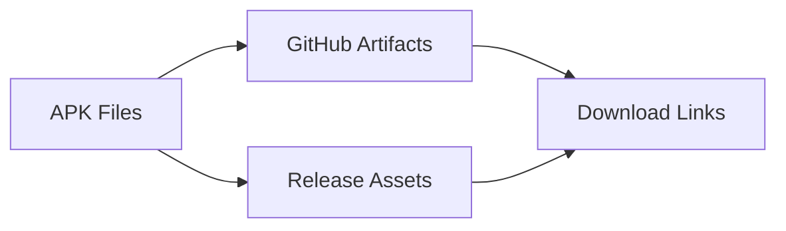

# APK Build Flow Documentation

This document provides a comprehensive overview of the Android APK build automation system for the Schuelerbeobachtung student observation application.

## 📋 Overview

The APK build flow transforms your React-based web application into native Android APKs using automated GitHub Actions workflows. This system enables continuous deployment of mobile apps without requiring local Android development tools.

## 🏗️ Architecture

### Build Stack
```
React/TypeScript App (Frontend)
    ↓
Vite Build System (Web Assets)
    ↓
Capacitor (Native Bridge)
    ↓
Android Gradle (APK Generation)
    ↓
GitHub Actions (Cloud Build)
    ↓
Downloadable APK Files
```

### Key Components
- **Web Layer**: React + TypeScript + Tailwind CSS
- **Build Tool**: Vite for optimized web asset compilation
- **Native Bridge**: Capacitor v7 for web-to-native integration
- **Android Framework**: Gradle build system with Android SDK 34
- **CI/CD**: GitHub Actions for automated cloud builds

## 🔄 Build Flow Stages

### Stage 1: Source Code Preparation


**Triggers:**
- Push to `Dev`, `master`, or `main` branches
- Pull request creation
- Manual workflow dispatch
- GitHub release creation

**Process:**
1. **TypeScript Compilation**: `tsc` compiles TypeScript to JavaScript
2. **Asset Bundling**: Vite bundles and optimizes CSS, JS, and assets
3. **Output**: Production-ready files in `dist/` directory

### Stage 2: Capacitor Integration


**Process:**
1. **Asset Copy**: Web assets moved to `android/app/src/main/assets/public/`
2. **Configuration**: `capacitor.config.ts` defines app metadata
3. **Plugin Integration**: Native plugins configured for device features
4. **WebView Setup**: Android WebView configured to load local assets

### Stage 3: Android Build Environment


**Environment Setup:**
- **OS**: Ubuntu Latest (GitHub Actions runner)
- **Node.js**: Version 18 with npm cache
- **Java**: Temurin JDK 17 for Android development
- **Android SDK**: Latest SDK with build tools 34.0.0
- **Dependencies**: Capacitor CLI and Android platform

### Stage 4: APK Compilation


**Build Process:**
1. **License Acceptance**: Android SDK licenses automatically accepted
2. **Dependency Resolution**: Gradle downloads required dependencies
3. **Resource Compilation**: Android resources processed with AAPT2
4. **Code Compilation**: Java/Kotlin code compiled to bytecode
5. **DEX Generation**: Bytecode converted to Android DEX format
6. **APK Assembly**: All components packaged into APK files

### Stage 5: Artifact Distribution


**Distribution Methods:**
1. **Workflow Artifacts**: Temporary downloads (30-day retention)
2. **Release Attachments**: Permanent downloads attached to GitHub releases
3. **Automatic Versioning**: APKs tagged with build numbers

## 📁 File Structure

### Source Files
```
DSGVO/
├── src/                          # React source code
├── src-tauri/                    # Tauri backend (optional)
├── dist/                         # Built web assets
├── android/                      # Generated Android project
│   ├── app/src/main/
│   │   ├── assets/public/        # Web assets location
│   │   ├── java/                 # Android Java code
│   │   └── AndroidManifest.xml   # App permissions & config
│   └── build/outputs/apk/        # Generated APK files
└── .github/workflows/            # CI/CD automation
```

### Generated APK Structure
```
app-debug.apk
├── AndroidManifest.xml           # App metadata
├── classes.dex                   # Compiled application code
├── resources.arsc                # Compiled resources
├── assets/public/                # Web application files
│   ├── index.html               # Main HTML entry point
│   ├── assets/                  # CSS, JS, images
│   └── capacitor.config.json    # Runtime configuration
└── META-INF/                    # Signing information
```

## ⚙️ Workflow Configuration

### Main Build Workflow (`build-android-apk.yml`)

**Triggers:**
- `push` to `master`, `main`, `Dev` branches
- `pull_request` to main branches
- `workflow_dispatch` (manual trigger)

**Steps:**
1. **Checkout**: Clone repository code
2. **Setup Environment**: Install Node.js, Java, Android SDK
3. **Install Dependencies**: `npm ci` for reproducible builds
4. **Build Web Assets**: `npm run build` creates production bundle
5. **Capacitor Setup**: Initialize and sync Android project
6. **Accept Licenses**: Automatically accept Android SDK licenses
7. **Build APKs**: Generate both debug and release versions
8. **Upload Artifacts**: Make APKs available for download

### Release Workflow (`build-android-on-release.yml`)

**Triggers:**
- GitHub release publication
- Manual dispatch with version input

**Features:**
- Automatic APK attachment to releases
- Version-specific naming
- Optional APK signing (when keystore configured)

## 🔧 Configuration Files

### Capacitor Configuration (`capacitor.config.ts`)
```typescript
import type { CapacitorConfig } from '@capacitor/cli';

const config: CapacitorConfig = {
  appId: 'com.school.schuelerbeobachtung',
  appName: 'Schuelerbeobachtung',
  webDir: 'dist',
  server: {
    androidScheme: 'https'
  }
};
```

### Android Manifest (`android/app/src/main/AndroidManifest.xml`)
```xml
<manifest xmlns:android="http://schemas.android.com/apk/res/android"
    package="com.school.schuelerbeobachtung">

    <uses-permission android:name="android.permission.INTERNET" />
    <uses-permission android:name="android.permission.WRITE_EXTERNAL_STORAGE" />

    <application
        android:allowBackup="true"
        android:icon="@mipmap/ic_launcher"
        android:label="@string/app_name"
        android:theme="@style/AppTheme">

        <activity android:name=".MainActivity" android:exported="true">
            <intent-filter>
                <action android:name="android.intent.action.MAIN" />
                <category android:name="android.intent.category.LAUNCHER" />
            </intent-filter>
        </activity>
    </application>
</manifest>
```

### Build Configuration (`android/app/build.gradle`)
```gradle
android {
    namespace 'com.school.schuelerbeobachtung'
    compileSdk 34

    defaultConfig {
        applicationId 'com.school.schuelerbeobachtung'
        minSdk 24
        targetSdk 34
        versionCode 1
        versionName '0.1.0'
    }

    buildTypes {
        release {
            minifyEnabled false
            proguardFiles getDefaultProguardFile('proguard-android-optimize.txt')
        }
    }
}
```

## 📊 Build Metrics

### Typical Build Times
- **Environment Setup**: ~2-3 minutes
- **Web Asset Build**: ~30-60 seconds
- **Android Compilation**: ~3-5 minutes
- **Total Build Time**: ~6-10 minutes

### Output Sizes
- **Web Assets**: ~661KB (optimized)
- **Debug APK**: ~8-12MB (includes debugging symbols)
- **Release APK**: ~5-8MB (optimized and minified)

### Supported Architectures
- **Primary**: ARM64 (aarch64) - Modern Android devices
- **Secondary**: ARMv7 (arm) - Older Android devices
- **Testing**: x86_64 - Android emulators

## 🔍 Troubleshooting

### Common Build Failures

#### 1. TypeScript Compilation Errors
**Symptoms**: Build fails during `tsc` step
**Solutions**:
- Check TypeScript syntax in source files
- Verify type definitions are up to date
- Run `npm run lint` locally to catch issues

#### 2. Android License Issues
**Symptoms**: "SDK licenses not accepted" error
**Solutions**:
- Verify workflow has license acceptance step
- Check Android SDK version compatibility
- Update license hashes if needed

#### 3. Capacitor Sync Failures
**Symptoms**: "Failed to sync Android project"
**Solutions**:
- Ensure `dist/` directory contains built assets
- Verify `capacitor.config.ts` is valid
- Check Capacitor plugin compatibility

#### 4. Gradle Build Failures
**Symptoms**: Android compilation errors
**Solutions**:
- Check Android target SDK compatibility
- Verify Gradle wrapper permissions
- Update Android Gradle Plugin version

### Debug Strategies

#### 1. Local Testing
```bash
# Build web assets locally
npm run build

# Sync with Android project
npx cap sync android

# Open in Android Studio
npx cap open android
```

#### 2. Workflow Debugging
- Enable verbose logging in GitHub Actions
- Check individual step outputs
- Download and inspect failed artifacts
- Compare with successful builds

#### 3. APK Analysis
```bash
# Extract APK contents
unzip app-debug.apk -d extracted/

# Check web assets
ls extracted/assets/public/

# Verify manifest
cat extracted/AndroidManifest.xml
```

## 🚀 Optimization Strategies

### Build Performance
1. **Dependency Caching**: GitHub Actions caches npm dependencies
2. **Parallel Builds**: Multiple APK variants built simultaneously
3. **Incremental Builds**: Only changed components rebuilt
4. **Artifact Compression**: Reduce upload/download times

### APK Size Reduction
1. **Code Splitting**: Vite automatically splits large bundles
2. **Tree Shaking**: Unused code eliminated during build
3. **Asset Optimization**: Images and fonts compressed
4. **ProGuard**: Code obfuscation and minification (release builds)

### Security Enhancements
1. **APK Signing**: Optional keystore-based signing for production
2. **Permissions Audit**: Minimal required permissions
3. **Content Security Policy**: Secure WebView configuration
4. **Certificate Pinning**: Optional network security

## 📈 Monitoring and Analytics

### Build Success Metrics
- **Success Rate**: Percentage of successful builds
- **Build Duration**: Average time for complete builds
- **Artifact Size**: APK size trends over time
- **Download Frequency**: Usage analytics for releases

### Quality Assurance
- **Automated Testing**: Unit tests run before APK generation
- **Lint Checks**: Code quality verification
- **Security Scanning**: Dependency vulnerability checks
- **Performance Monitoring**: Build time optimization

## 🔄 Continuous Improvement

### Future Enhancements
1. **Automated Testing**: Integration with device testing farms
2. **Progressive Web App**: PWA capabilities alongside native APK
3. **App Store Integration**: Automated Play Store deployment
4. **Multi-Platform**: iOS build support with Capacitor

### Maintenance Tasks
- **Dependency Updates**: Regular updates for security and features
- **SDK Version Updates**: Keep Android targets current
- **Workflow Optimization**: Improve build times and reliability
- **Documentation Updates**: Keep build flow documentation current

---

## 📞 Support

For build issues or questions:
1. Check GitHub Actions workflow logs
2. Review this documentation
3. Test locally with Android Studio
4. Create GitHub issue with build details

**Last Updated**: October 2024
**Build System Version**: Capacitor 7.x + GitHub Actions